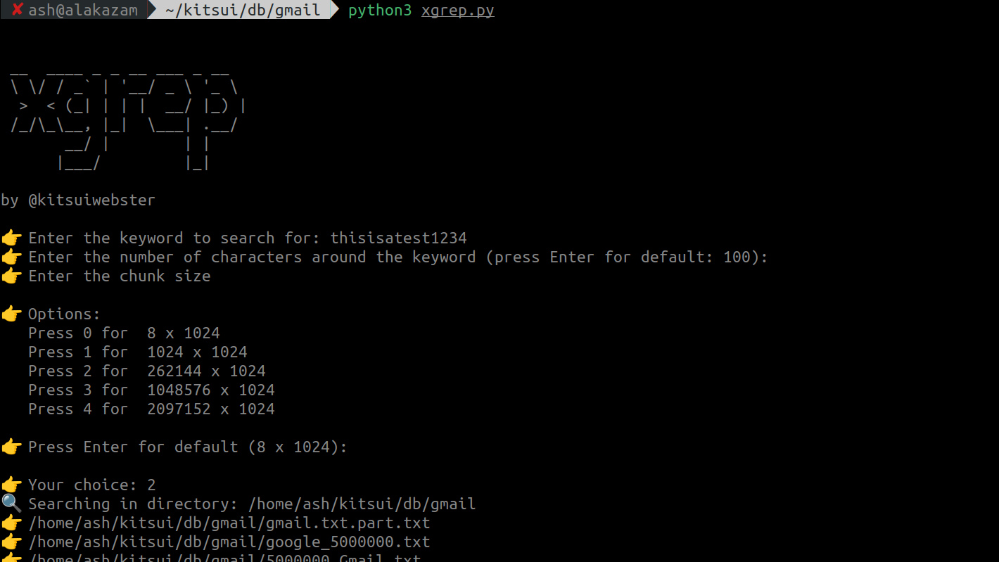
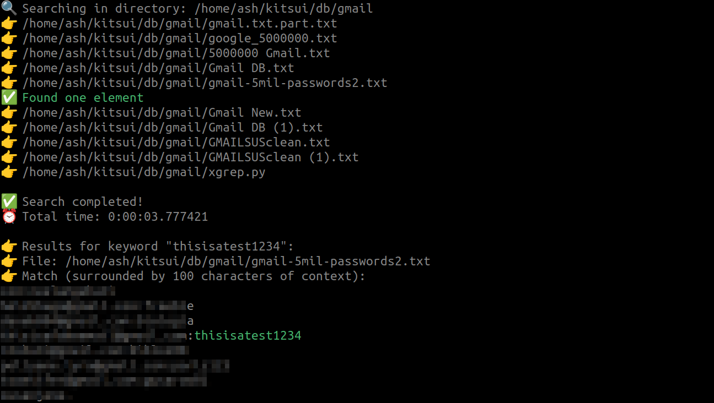
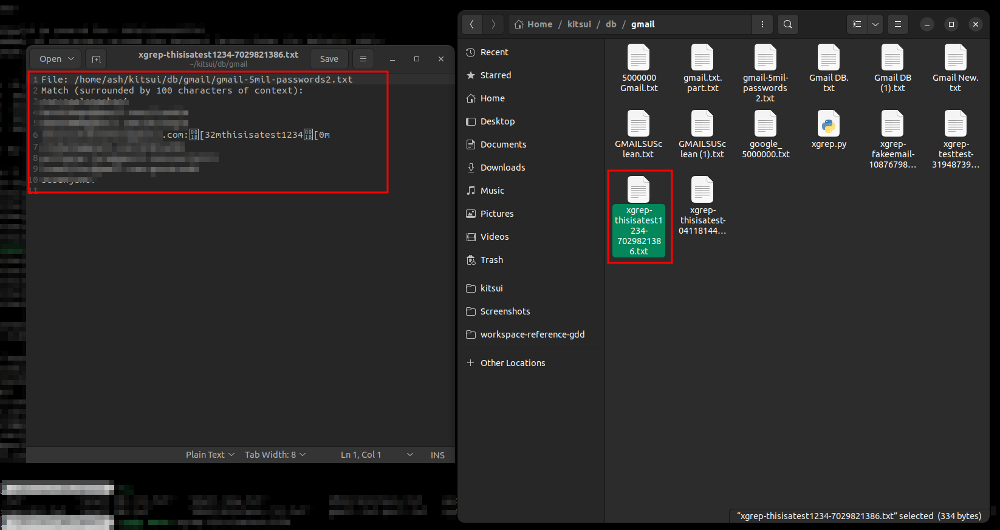

# xgrep

xgrep is a powerful Python script designed to search for keywords in various file types within a specified directory. It provides a simple and efficient way to find and highlight keywords, making it a handy tool for developers, researchers, and data analysts.

## Features

- Searches for keywords in multiple file types
- Provides context around the keyword
- Handles large files efficiently
- Saves search results in a text file

## Installation

To use xgrep, simply download the script from this repository. You'll also need to install the required package listed in `requirements.txt`. You can do this by running the following command in your terminal:

```bash
pip install -r requirements.txt
```

## Usage

1. Open your terminal or command prompt.
2. Navigate to the directory where you saved the xgrep script.
3. Run the script using the command `python xgrep.py`.
4. Enter the keyword you want to search for when prompted.
5. Press Enter to use the default context value or enter a new value. The context value determines the number of characters displayed around the keyword.
6. Press Enter to use the default chunk size or enter a new value. The chunk size determines the amount of data read from a file at once. The available chunk size options are:
   - 8 x 1024
   - 1024 x 1024
   - 262144 x 1024
   - 1048576 x 1024
   - 2097152 x 1024
7. The script will start searching for the keyword recursively from the current directory and display the results.
8. It will also output the results in a .txt file.





